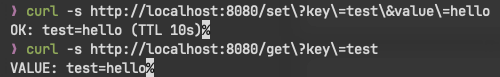
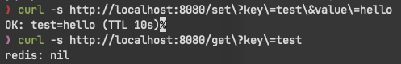
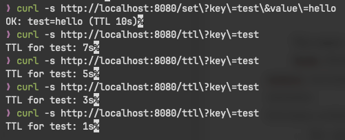

# Практическая работа №7
## Подключение и работа с Redis (set/get, TTL). Реализация простого кэша.
## Рузин Иван Александрович ЭФМО-01-25

## Скриншоты

- Проверка операций `/set` и `/get`

- Поведение ключа после истечения времени жизни (через 10 секунд)

- Получение оставшегося времени жизни ключа через `/ttl`

## Краткое описание: что делает Redis и зачем нужен TTL.

Redis — это in-memory хранилище формата «ключ–значение», ориентированное на максимально быстрый доступ к данным. За счёт хранения информации в оперативной памяти Redis часто применяется для временного хранения данных, кэширования результатов запросов и снижения нагрузки на основные источники данных.

Механизм TTL (time-to-live) позволяет задавать время жизни ключей. По его истечении данные автоматически удаляются, что упрощает контроль объёма памяти и предотвращает использование устаревшей информации.